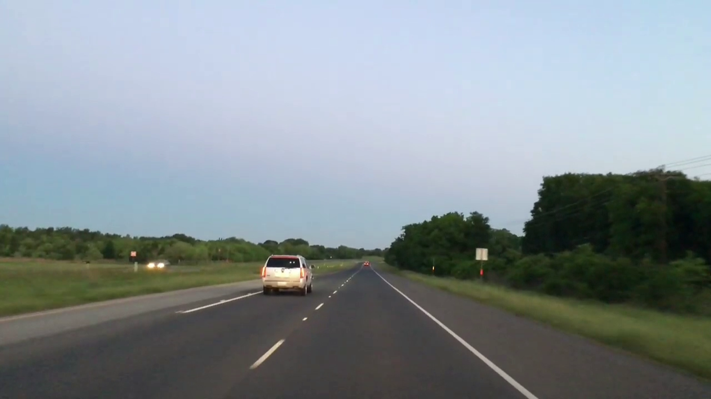

<!--
*** https://www.markdownguide.org/basic-syntax/#reference-style-links
-->
<!-- [![Contributors][contributors-shield]][contributors-url] -->
[![Forks][forks-shield]][forks-shield]
[![Stargazers][stars-shield]][stars-url]
<!-- [![Issues][issues-shield]][issues-url] -->
[![MIT License][license-shield]][license-url]
<!-- [![LinkedIn][linkedin-shield]][linkedin-url] -->

<!-- PROJECT LOGO -->
 

  

  <h3 align="center">Lane line detection using OpenCV</h3>

  
  

<!-- ABOUT THE PROJECT -->
# About The Project

I will use an image frame as a sample image, once we are able to detect lane lines in this image frame then we will club everything together which can accept dash cam video footage and detect lane lines on it. We will start with this image frame:

## Gaussian Blur
After, Gaussian Blur was applied.

## Converting into greyscale
Now, our image is blurred and ready for the next step, which is converting it into grayscale image before detecting edges. We need to apply Canny edge detection algorithm and it accepts images which have only 1 layer.

## Edge Detection
Now, we need to detect the edges with the help of Canny edge detection algorithm. Thankfully, opencv has already implemented it for us. 

## Region of Interest
We need only lane lines without other lines, that’s why we need to define our region of interest in order to define lines only in that region.

## Line Detection — Hough Transform
We apply Hough Transform and get the following result:

Finally, we put it on top of our original image and get our final result.

<!-- MARKDOWN LINKS & IMAGES -->
<!-- https://www.markdownguide.org/basic-syntax/#reference-style-links -->
[contributors-shield]: https://img.shields.io/github/contributors/github_username/repo.svg?style=for-the-badge
[contributors-url]: https://github.com/github_username/repo/graphs/contributors
[forks-shield]: https://img.shields.io/github/forks/sh-nishonov/lane-detector.svg?style=for-the-badge
[forks-url]: https://github.com/sh-nishonov/lane-detector/network/members
[stars-shield]: https://img.shields.io/github/stars/sh-nishonov/lane-detector.svg?style=for-the-badge
[stars-url]: https://github.com/sh-nishonov/lane-detector/stargazers
[issues-shield]: https://img.shields.io/github/issues/github_username/repo.svg?style=for-the-badge
[issues-url]: https://github.com/github_username/repo/issues
[license-shield]: https://img.shields.io/github/license/sh-nishonov/lane-detector.svg?style=for-the-badge
[license-url]: https://github.com/sh-nishonov/lane-detector/blob/main/LICENSE
[linkedin-shield]: https://img.shields.io/badge/-LinkedIn-black.svg?style=for-the-badge&logo=linkedin&colorB=555
[linkedin-url]: https://linkedin.com/in/github_username
